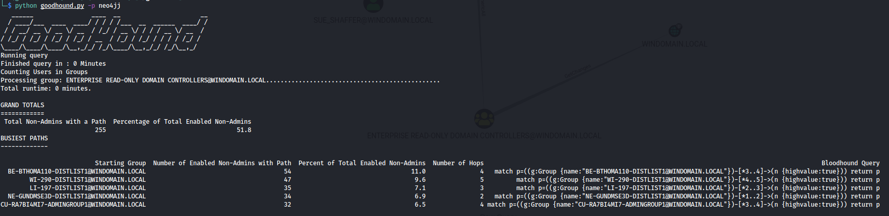
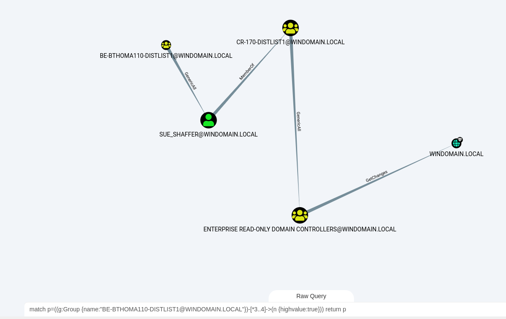

# GoodHound

```
   ______                ____  __                      __
  / ____/___  ____  ____/ / / / /___  __  ______  ____/ /
 / / __/ __ \/ __ \/ __  / /_/ / __ \/ / / / __ \/ __  / 
/ /_/ / /_/ / /_/ / /_/ / __  / /_/ / /_/ / / / / /_/ /  
\____/\____/\____/\__,_/_/ /_/\____/\__,_/_/ /_/\__,_/   
                                                         
```
> Attackers think in graphs, defenders think in actions, management think in charts.

GoodHound operationalises Bloodhound by determining the busiest paths to high value targets and creating actionable output to prioritise remediation of attack paths.

## Usage

### Default behaviour

All options are __optional__. The default behaviour is to connect to a neo4j server setup with the default ip (http://localhost:7474) and credentials (neo4j:neo4j), calculate the busiest paths from non-admin users to highvalue targets as defined with the default Bloodhound setup, and print the top 5 busiest paths to the screen.

The neo4j database will need to already have the Sharphound collector output uploaded using the Upload button in the Bloodhound GUI. An example Sharphound output collected using [Bad Blood](https://github.com/davidprowe/BadBlood) on a [Detection Labs](https://detectionlab.network/) can be found in this repo at [/Sample%20SharpHound%20Output](/Sample%20SharpHound%20Output).

The output shows a total number of unique users that have a path to a HighValue target.  
It then breaks this down to individual paths, ordered by the busiest path. 
Each path is then displayed showing the starting group, the number of non-admin users within that path, the number of hops and also a Cypher query. This cypher query can be directly copied into the Custom query bar in Bloodhound for a visual representation of the attack path. 

  
  


### Options

#### Database settings
-s can be used to point GoodHound to a server other than the default localhost installation  
-u can be used to set the neo4j username  
-p can be used to set the neo4j password  

#### Output formats
-o can be used to select from:  
- stdout -displays the output on screen
- csv saves a comma separated values file for use with reporting or MI (completing the graphs, actions, charts trifecta in the tagline)
- md or markdown to display a markdown formatted output  

-f an optional filename for the csv output option

#### Number of results
-r can be used to select the amount of results to show. By default the top 5 busiest paths are displayed.

#### Schema
-sch select a file containing cypher queries to set a custom schema to alter the default Bloodhound schema. This can be useful if you want to set the 'highvalue' label on AD objects that are not covered as standard, helping to provide internal context.
For example, you want to add the highvalue label to 'dbserver01' because it contains all of your customer records. The schema file to load in could contain the following cypher query:  
```
match (c:Computer {name:'DBSERVER01@YOURDOMAIN.LOCAL'}) set c.highvalue=TRUE
```
The schema can contain multiple queries, each on a separate line.

#### Query
-q can be used to override the default query that is run to calculate the busiest path. This can be useful if your dataset is large and you want to temporarily load in a query that looks at a smaller set of your data in order to quickly try GoodHound out.  
Care should be taken to ensure that the query provides output in the same way as the built-in query, so it doesn't stop any other part of GoodHound running.  
The original query is :  
```
'match p=shortestpath((g:Group)-[]->(n)) return distinct(g.name) as groupname, min(length(p)) as hops'
```
and so an example to retrieve a subset might be:  
```
'match p=shortestpath((g:Group {highvalue:FALSE})-[*1..]->(n {highvalue:TRUE})) WHERE tolower(g.name) =~ 'admin.*' return distinct(g.name) as groupname, min(length(p)) as hops'
```

### Performance

Larger datasets can take time to process. Some performance improvements can be seen by selecting to "warm-up" the database using the option in the Bloodhound GUI. There are also many guides for tuning the neo4j database for increased performance which are out of scope here (although if I make any significant improvements I'll document the findings).

## Installation

### Pre-requisites
- Python and pip already installed.
- Both neo4j and bloodhound will need to be already installed. The docs at https://bloodhound.readthedocs.io/en/latest/#install explain this well.

### Downloading GoodHound
Either download using git or by downloading the zip file and extract to your chosen location.
```
git clone https://github.com/thegoatreich/GoodHound.git
cd goodhound
```
__OR__
```
https://github.com/thegoatreich/GoodHound/archive/refs/heads/main.zip
```

- Install required Python modules.  
- Goodhound will install py2neo and pandas libraries, if you do not wish to change any local modules you already have installed it is recommended to use pipenv.  
```
pip install -r requirements.txt
```
## Acknowledgments
- The [py2neo](https://py2neo.org/2021.1/) project which makes this possible.
- The [PlumHound](https://github.com/PlumHound/PlumHound) project which gave me the idea of creating something similar which suited my needs.
- The [Bloodhound Gang Slack channel](bloodhoundhq.slack.com) for Cypher help.
- The [BloodHound project](https://bloodhound.readthedocs.io/en/latest/index.html) for changing the world.

## To do
- [x] option to output cypher to load busiest path into Bloodhound for report screenshot
- [x] add lowest number of hops to HV as a metric
- [x] tidy up code
- [x] Enter neo4j creds as parameters
- [x] Allow user choice for output format
- [x] User choice of number of results displayed
- [x] Query overide options
- [x] Export to csv
- [x] Documentation
- [x] can the hop count be done as part of the original shortestpath query?
- [x] Add count of total distinct users that have any path
- [x] add ability to setup schema
- [x] only the shortest path for each busiest path is displayed. If one pathway has many paths this will be hidden. Unsure if this is an issue or not.
- [ ] sometimes a path shows up twice if one group is a member of another group. An if statement to see if $group ismember of $group then break might work and might even speed up the process
- [x] Trial adding a score to hop type
- [ ] Make sure all edges have a score assigned
- [ ] Limit query time counting to verbose mode (use loggy?)
- [ ] Query Performance (is threading or neo4j tuning an option?)
- [ ] add ability to warm up database if possible.
- [ ] support encrypted neo4j connection.